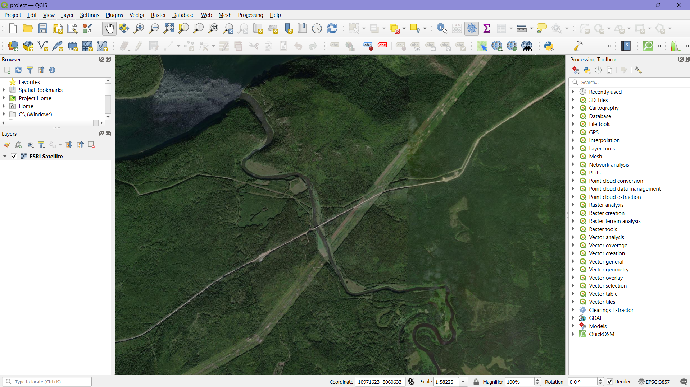

# Power line clearings extractor

"Power line clearings extractor" is a QGIS plugin designed to detect forest clearings under power lines from Sentinel-2 satellite imagery. It supports both individual and paired summer and winter images, as well as advanced batch processing. The plugin provides a user-friendly dialog interface and integrates advanced tools into the QGIS Processing Toolbox for efficient processing. It leverages algorithm implemented in the repository at the [link](https://github.com/yana-b27/clearings_extraction_algorithm) and also YOLO model algorithm.

The plugin automates:
- Validation of input raster images (band count and dimensions).
- Extraction of clearings using custom algorithms.
- Optional calculation of the Wide Dynamic Range Vegetation Index (WDRVI) for enhanced vegetation analysis.
- Saving results as GeoTIFF files with geospatial metadata.
- Visualization of results on the QGIS map canvas.

## Features
1. Dialog Interface
  - Intuitive GUI for selecting summer and winter images (optional for YOLO) and an output directory.
  - Option to add source images to the map alongside results.
  - Real-time logging with colored feedback (green for success, red for errors).
2. Processing Toolbox Integration
  - Extract Clearings: Process a single image or image pair.
  - Iterate Clearings Extractor: Batch process multiple images or image pairs from directories.
3. Core Functionality
  - Validates summer images (5 bands) and winter images (3 bands, required for Logistic Regression + Probabilistic Hough line transform).
  - Ensures matching dimensions between image pairs when using Logistic Regression + Probabilistic Hough line transform.
  - Supports two detection methods:
     - Logistic Regression + Probabilistic Hough line transform: Creates a classification map, extracts a binary mask of low vegetation ("grassland"), and uses boundary detection with Hough Probabilistic Transform to identify clearing boundaries.
     - YOLO Neural Network: Utilizes a pre-trained model for direct segmentation of clearings and supports WDRVI calculation.
  - Overwrites existing output files to prevent duplication (_in development_).
  - Automatically adds results (clearing masks and WDRVI layers, if calculated) to the QGIS map with unique layer names.

## Directory Structure

Below is the structure of the plugin directory:

```
clearings_extractor_qgis/
├── __init__.py                   # Plugin metadata and initialization
├── clearings_extractor.py        # Main plugin logic and dialog handling
├── clearings_extractor_dialog.py # Dialog class generated from UI file
├── clearings_extractor_dialog_base.ui # QGIS UI design file (Qt Designer)
├── extraction_algorithm.py       # Core algorithms for clearing detection
├── resources.py                  # Compiled resources (e.g., icons)
├── help/                         # Documentation files
│   └── index.rst                 # Main help file in reStructuredText
├── i18n/                         # Internationalization files
│   └── ClearingsExtractor_en.ts  # English translation file
├── README.md                     # This file, plugin overview
├── pb_tool.cfg                   # Configuration for pb_tool (optional)
└── plugin_upload.py              # Script for uploading to QGIS repository
```

## Video example

Сlick on the preview below to open the video in Google Drive:

[](https://drive.google.com/file/d/1oe7grTqy6GXvybtimDTYfABXdhE61Yso/view?usp=sharing)

## Web map example

Web map example of calculated power line clearings masks and WDRVI indices on the [link](https://ee-ybahramhan.projects.earthengine.app/view/power-line-clearings-monitoring)

